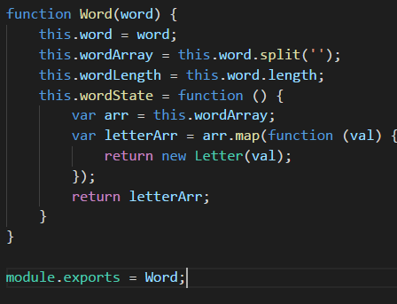

# Constructor_Hangman
<!--  -->
In this project I'm using Node.js to create a hangman command line game using constructor functions.&nbsp; The game receives user input using the *inquirer npm package* which is a dependency included in the package.json file.&nbsp; I created two **Constructor Functions**, one for Word and one for Letter.

 
 
 
 
 
Here is an example of a constructor function:
 

 
JavaScript is a prototype based language in which we reuse existing objects that serve as prototypes. &nbsp;In the function Word we are adding several methods to the object word such as this.word and this.wordArray.&nbsp; Module.exports takes the Word function and exports it to our hangman.js file.
 
 
Good Luck!

 

 

 

 
